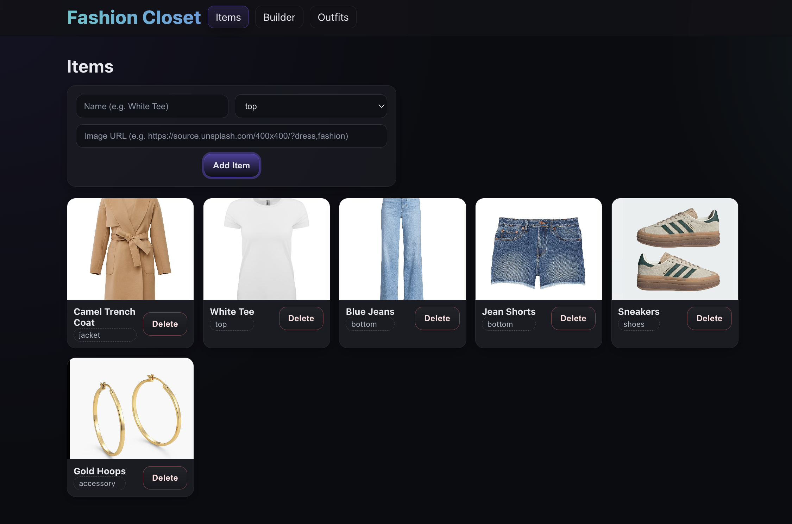
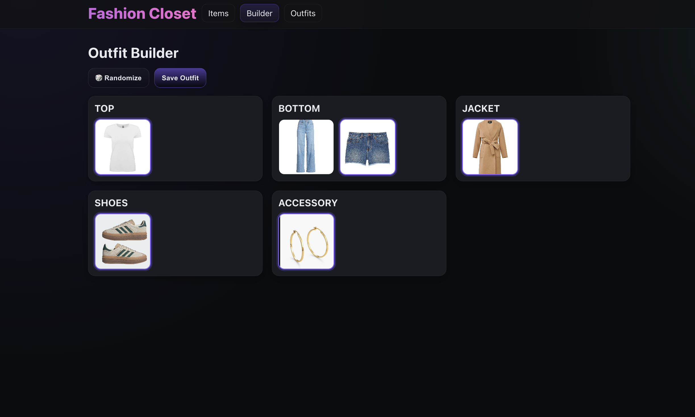
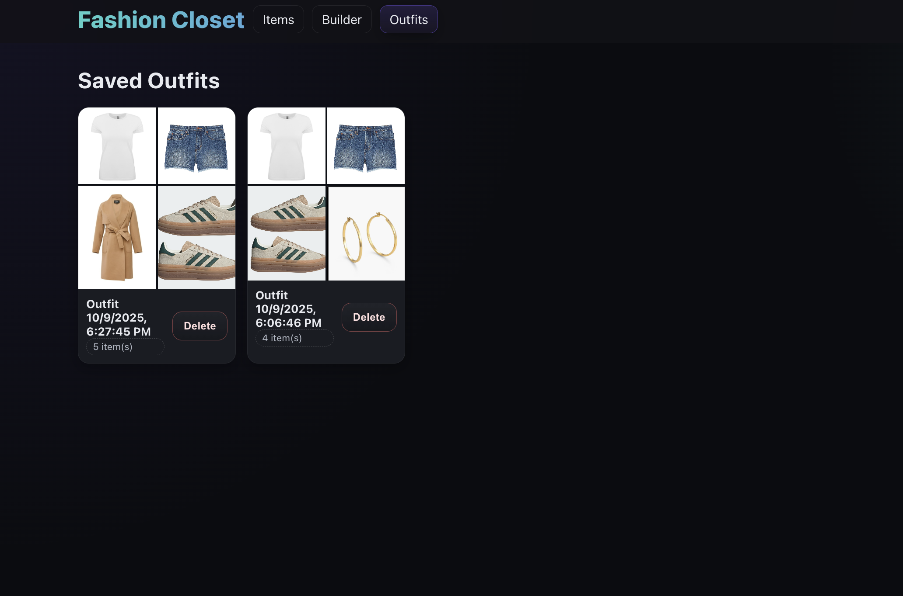
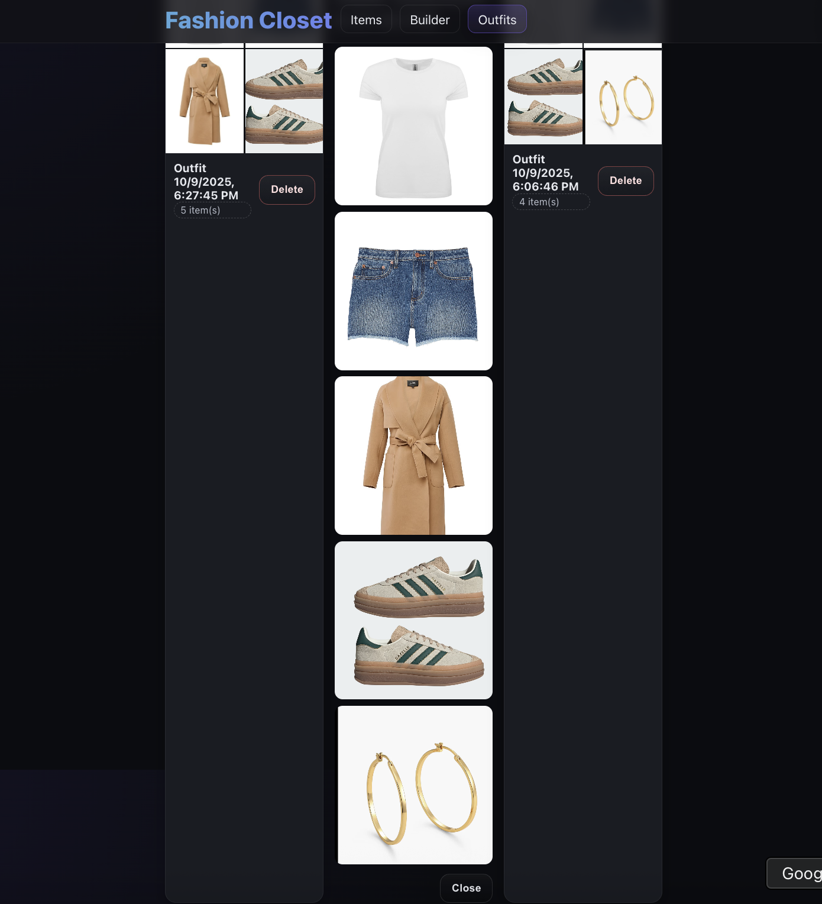

## 👗 My Fashion Closet — Full Stack Wardrobe App

A responsive web application built with **React**, **Node.js**, and **PostgreSQL**  
to manage and visualize outfits interactively.

### 🖼️ UI Preview

| Home Page | Builder Page |
|------------|--------------|
|  |  |

| Saved Outfits | Outfit Modal |
|----------------|--------------|
|  |  |

---

### ⚙️ Tech Stack
- **Frontend:** React, CSS  
- **Backend:** Node.js, Express  
- **Database:** PostgreSQL  

### 🚀 Features
- Add, view, and organize clothing items  
- Build and save outfits  
- View saved outfits in a responsive modal  
- Simple and clean UI  
